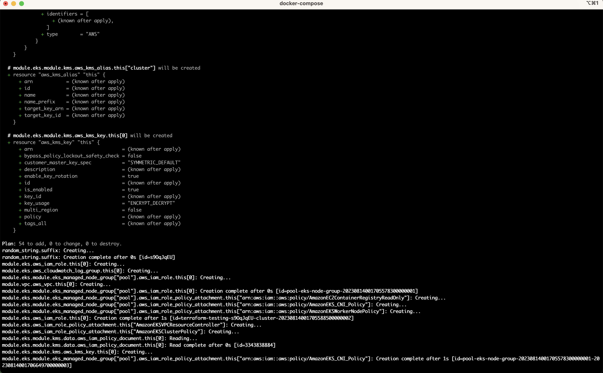

# ☁️ Cloud-in-a-Box ☁️

This example provides a working AWS cloud via LocalStack[^1] along with an EKS Kubernetes (k8s) cluster created via Terraform and helpful management tools.

It can serve as a local playground, starting point for local application development and testing, or just a way to get more familiar with containers, Kubernetes, terraform, and the other tools used here.

Also, **_everything_** runs in containers, so you only need the usual [3musketeers setup](../../README.md) to use this example!

## Preparation - DO THIS FIRST

Run `make prep` to download the docker images you'll need for this example. It could take 5-10 minutes depending on your network connection, so you should run this **now**, then come back to read the rest of the readme.


You could skip this step and let the images download as you run commands, but doing this first will make the rest of the walkthrough feel a lot faster.

## Guide

This guide walks you through the creation of a local Kubernetes cluster and sample app deployment.

### LocalStack

**Note:** You'll need a LocalStack Pro API Key. Go to https://app.localstack.cloud/ where you can sign up for a free account, and a 14-day trial. Once you start your trial you'll get an API key.

In this section we'll start a local AWS cloud with **many** _emulated_ services.

1. Copy the `env.example` and set your LocalStack API key (ie the `LOCALSTACK_API_KEY` value in the .env file after you copy the example file)
   ```shell
   cp env.example .env
   ```

2. Start the LocalStack cloud environment
   ```shell
   make localstack
   ```


You should see:
- "successfully activated API key"
- "Found credentials in environment variables."
- "hypercorn.error            : Running on https://0.0.0.0:XXX (CTRL + C to quit)"
- "Execution of "start_runtime_components" took XXX ms"
- "Ready."


See the [LocalStack Configuration](#localstack-configuration) section for environment variables you can modify to control the behavior of LocalStack.

**`TIP`** You can access the LocalStack web-based resource browser at https://app.localstack.cloud/resources

**Troublehsooting**

If you get DNS issues, you may have internet/networking problems. Try on a more stable internet connection.

```
cloud_in_a_box-localstack-1  | 2023-08-13T02:43:49.761  INFO --- [uest_thread)] l.services.dns_server      : Unable to get DNS result from fallback server 127.0.0.11 for domain raw.githubusercontent.com.: The DNS operation timed out.
```


### Terraform

Now we can run our Infrastructure as Code (IaC) to create a working _emulated_ EKS cluster locally.

You should already have one terminal tab running for LocalStack, so open a new terminal tab for your Terraform commands.

1. Initialize Terraform and download necessary modules
   ```shell
   make terraform init
   ```


You should see:
- "Terraform has been successfully initialized!"


2. Do a _dry run_ to see what changes Terraform would make (review the [`main.tf`](main.tf) to see the source IaC)
   ```shell
   make terraform plan
   ```



You should see:
- "Plan: 54 to add, 0 to change, 0 to destroy." ??? (**`NOTE`** Number to add may vary slightly)
- "Warning: AWS account ID not found for provider" ???

3. Apply the changes without prompting for approval[^2]
   ```shell
   make -- terraform apply -auto-approve
   ```

At this point we have a functional EKS cluster as well as the other resources defined in the `main.tf` Terraform file.

Let's exercise some of the tools and inspect our infrastructure!

**Troubleshooting**

If you get errors in the terraform commands try the following:

Run `make -- terraform apply -auto-approve` again after a few minutes (maybe some resources needed time to load).

If that doesn't work, try running localstack again by hitting "ctrl+c" on your `make localstack` command, running `make down` then `make clean` and trying `make localstack` again.

```
│ Error: reading EC2 Network ACL (acl-2a79103e): InvalidRouteTableID.NotFound: The routeTable ID 'acl-2a79103e' does not exist
│ 	status code: 400, request id: 3f2e7cac-164b-405b-9e8b-7e5d251444b8
│
│   with module.vpc.aws_default_network_acl.this[0],
│   on .terraform/modules/vpc/main.tf line 1256, in resource "aws_default_network_acl" "this":
│ 1256: resource "aws_default_network_acl" "this" {
```

### AWS CLI

LocalStack typically uses an _awslocal_ wrapper which points the official AWS CLI at the local cloud instance. We emulate that same behavior using an `awslocal` target in our 3Musketeers setup.

1. Check setup and confirm connectivity with LocalStack (dummy caller / account data is returned)
   ```shell
   make awslocal sts get-caller-identity
   ```
2. List the VPCs in our local AWS cloud
   ```shell
   make awslocal ec2 describe-vpcs
   ```
3. List all Subnets (both default and the ones we created in our VPC)
   ```shell
   make awslocal ec2 describe-subnets
   ```

Continue to inspect the infrastructure using additional AWS CLI commands.  **`NOTE`** that not
_all_ AWS capabilities are mimicked by LocalStack, so you may encounter empty results or other unexpected behavior in some cases.

When you're finished, move to the next section to test our local EKS cluster.

### Kubernetes (k8s)

Now let's configure our k8s client to talk to the EKS cluster we created.

1. List the local EKS cluster info, then copy the cluster name from the output to use in the next step (e.g. `terraform-testing-haksfasE`)
   ```shell
   make awslocal eks list-clusters
   ```

   **`TIP`** You can also run `make -- awslocal eks list-clusters --query 'clusters[0]'` to print just the name
2. Generate a kubeconfig file `kube.config` for the cluster
   ```shell
   CLUSTER_NAME=$(make -- awslocal eks list-clusters --query 'clusters[0]')
   
   make -- awslocal eks update-kubeconfig --name $CLUSTER_NAME --kubeconfig kube.config
   ```
3. Run `kubectl` to return some basic cluster information
   ```shell
   make kubectl cluster-info
   ```
   **`NOTE`** The
   _kubectl_ target automatically configures `kubectl` to use our generated `kube.config` and LocalStack AWS credentials
4. List everything running in our EKS cluster already
   ```shell
   make -- kubectl get all --all-namespaces
   ```

Next we'll launch a sample app in the cluster!

### Sample App

These steps are derived from the [Amazon EKS - Deploy a sample application](https://docs.aws.amazon.com/eks/latest/userguide/sample-deployment.html) guide.

1. Create a k8s namespace for our sample app
   ```shell
   make kubectl create namespace eks-sample-app
   ```
2. Create the app's _Deployment_ which manages the application instances or _Pods_
   ```shell
   make -- kubectl apply -f eks-sample-deployment.yaml
   ```
3. Create a _Service_ for the app, enabling a single point of access
   ```shell
   make -- kubectl apply -f eks-sample-service.yaml
   ```
4. List all the components of our application
   ```shell
   make -- kubectl get all -n eks-sample-app
   ```
   **`NOTE`** the _ReplicaSet_ was created automatically for us by k8s

Feel free to follow additional steps in the AWS guide (adapting the instructions as above) to validate that the service is working. In the next section we'll configure a terminal-based "graphical" k8s client and use that to browse the cluster.

### k9s

[k9s](https://github.com/derailed/k9s) is a Kubernetes CLI that provides a visual interface to k8s clusters. It uses key bindings similar to `vi` which makes it easy to learn.

This section also demonstrates the use of a `Dockerfile` to build and run a custom image. The public `k9s` container image doesn't have the AWS CLI installed, which we need to authenticate to our cluster.

1. Build the image for our customized `k9s` Dockerfile
   ```shell
   make k9s-build
   ``` 
2. Run k9s
   ```shell
   make k9s
   ``` 
   You should be presented with a console-based
   _graphical_ interface showing all the pods in our cluster. Type `?` for commands.
3. Shell into a _Pod_ for our sample app and test it
    1. Use `j` and `k` to highlight one of the _eks-sample..._ _Pods_
    2. Type `s` to start a shell on the running _Pod_
    3. Use `curl` to validate that the sample app is working
       ```shell
       curl eks-sample-linux-service
       ```
       You should see some HTML output containing a message that the server is successfully installed and working. When you're finished in the
       _Pod_ shell, type `exit` (or `ctrl-d`) to return to k9s.

       From here you can continue to play with k9s, or exit and follow the [Cleanup](#cleanup) section to tear everything down.

### Cleanup

Now let's remove _everything_ 😁

1. Remove the sample EKS app from the cluster
   ```shell
   make kubectl delete namespace eks-sample-app
   ``` 
   **`NOTE`** This removes all resources associate with the namespace we created initially in a single step
2. Destroy all the infrastructure via Terraform
   ```shell
   make terraform destroy  # type 'yes' at the prompt to delete *everything*
   ``` 

   Now you can shut down LocalStack if you wish.

🏁 That's the end of this guide!

## Configuration

The following settings in the `.env` file can be used to alter various behaviors.

### LocalStack

<dl>
<dt>LOCALSTACK_DEBUG</dt>
<dd>
    <code>0</code> - use standard log level  <code>default</code><br/>
    <code>1</code> - enable debug logging
</dd>
<dt>LOCALSTACK_PERSISTENCE</dt>
<dd>
    <code>0</code> - reset cloud state each restart <code>default</code><br/>
    <code>1</code> - persist cloud state between restarts<br/><br/>
    <code><b>NOTE</b></code> not all services are supported.  See <a href="https://docs.localstack.cloud/references/persistence-mechanism/#service-coverage" target="_blank">LocalStack Persistence Mechanism - Service Coverage</a> for a current list.
</dd>
<dt>LOCALSTACK_SNAPSHOT_SAVE_STRATEGY</dt>
<dd>This settings controls the method and frequency for cloud state persistence.  The  <code>default</code> option <code>ON_REQUEST</code> persists state on every API call.  See <a href="https://docs.localstack.cloud/references/persistence-mechanism/#save-strategies" target="_blank">LocalStack Persistence Mechanism - Save Strategies</a> for other options you can set here.
</dd>
<dt>LOCALSTACK_ACTIVATE_PRO</dt>
<dd>
    <code>0</code> - disable LocalStack Pro features<br/>
    <code>1</code> - enable LocalStack Pro features (required for this example) <code>default</code>
</dd>
</dl>

### Terraform

<dl>
<dt>TF_LOG</dt>
<dd>
    <code>ERROR</code> - log error messages and standard output only <code>default</code> <br/>
    <code>DEBUG</code> - enable DEBUG level logging <br/></br>
   This setting changes the Terraform log level to facilitate troubleshooting. See <a href="https://developer.hashicorp.com/terraform/internals/debugging" target="_blank">Debugging Terraform</a> for other valid values.
</dd>
</dl>

[^1]: LocalStack Pro version required. Set `LOCALSTACK_API_KEY` via environment or `.env` file.
[^2]: The extra `--` is required to prevent `make` from processing the `-auto-approve` argument.
